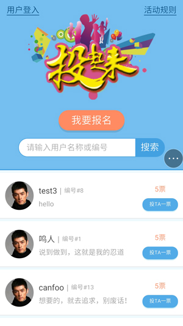
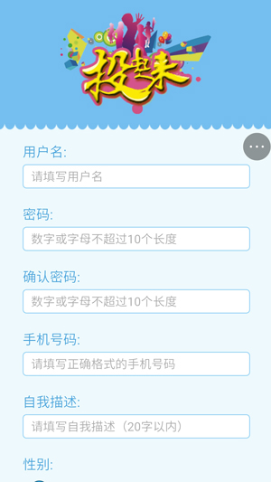
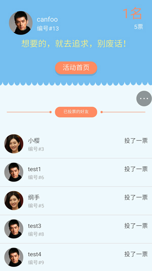
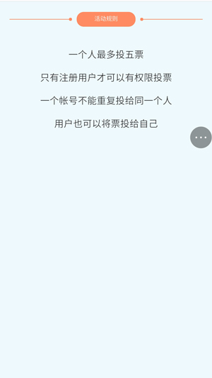

# 全栈投票实战项目
* 基于nodejs && express的后台服务
* 基于zepto的前端网页构建
* 前后数据分离

###注：头像上传功能暂时没加上去，用户头像都采用默认头像



---



---



---


---



---

## 运行项目

克隆项目

```
> $ git clone https://github.com/CanFoo/vote.git
```
在vote目录下安装依赖包

```
> $ npm install
```
启动服务器

```
> $ npm run start
```
执行完`npm run start`命令后，打开浏览器 `http://localhost:8080/vote/index`运行项目访问项目

---

## 项目说明

1. 项目需求
	- 实现投票获奖活动，票数越高，排名越高。
	- 只有注册用户才可以参加投票，每人最多投5票，不能投两票以上给同一个人。
	- 首页用户信息十条一分页。
	- 个人详细页需要显示投票者信息。


2. 页面访问地址
	- 首页：[localhost:8080/vote/index](localhost:8080/vote/index)
	- 报名页：[localhost:8080/vote/register](localhost:8080/vote/register)
	- 个人详细页：[localhost:8080/vote/detail/{id}](localhost:8080/vote/detail)
	- 搜索页：[localhost:8080/vote/search](localhost:8080/vote/search)
	- 规则页：[localhost:8080/vote/rule](localhost:8080/vote/rule)
	
3. 后台接口
	- 首页加载用户信息
	
	```
	method: GET
	url: /vote/index/data?limit=10&offset=0
	参数说明: limit为每页限制数量，offset为偏移量
	返回数据：errno为0，数据正确
	```
	- 首页投票请求
	
	```
	method: GET
	url: /vote/index/poll?id={被投票者id}&voterId={投票者id}
	返回数据：errno为0，数据正确		
	```
	- 首页登入请求
	
	```
	method: POST
	url: /vote/index/info
	sendData:  {
					password: {用户密码},
					id: ｛用户编号｝
				}
	返回数据：errno为0，数据正确		
	```
	- 搜索页搜索内容
	
	```
	method: GET
	url: /vote/index/search?content={搜索内容}
	返回数据：errno为0，数据正确
	```
	- 报名页报名请求
	
	```
	method: POST
	url: /vote/register/data
	sendData:  {
			       username: {用户名},
				   mobile: {手机号码},
				   descrption: {描述},
				   gender: {性别},
				   password: {用户密码}
			   }
	返回数据：errno为0，数据正确		
	```
	- 搜索页搜索内容
	
	```
	method: GET
	url: /vote/all/detail/data?id={用户id}
	返回数据：errno为0，数据正确
	```
	